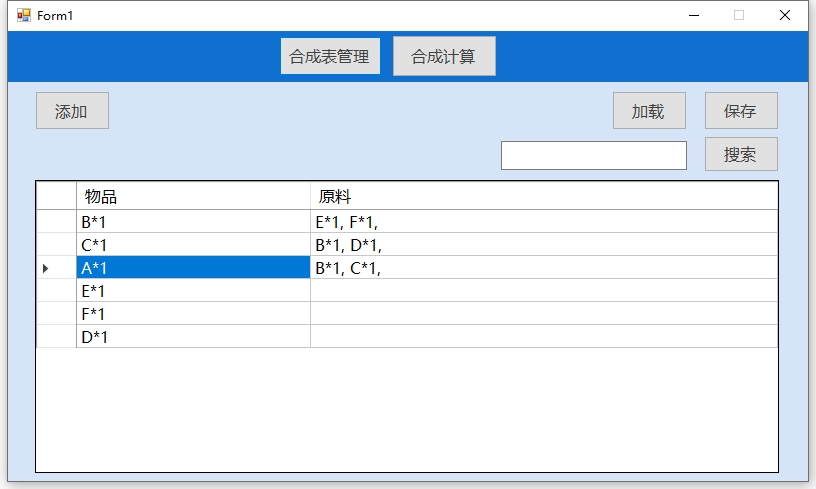
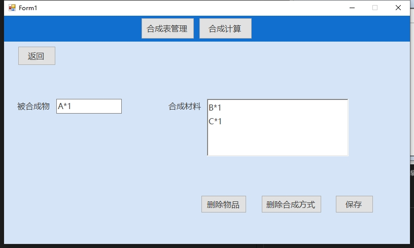
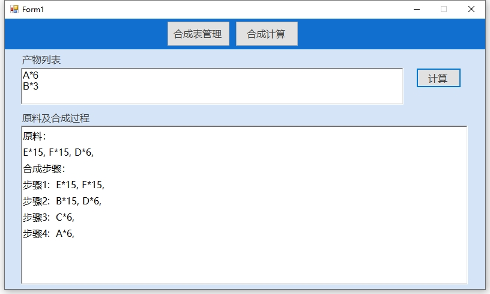

# 用C#开发的我的世界合成表计算器
## 简介
初学C#，出于兴趣和练手的目的写了这个程序，还有很多待完善之处，后续有时间再改进。
## 合成表管理
支持添加，修改，删除，查询合成表及物品。合成表数据可以保存到同目录下的本地文件Crafting_table中，也可以从文件将数据加载到软件中.

添加物品的输入格式为：物品名*数量，多个物品用换行隔开，数量可以不写，默认为1。例如：
```
木镐*5
石剑
铁锭*90
```

 
双击界面表格中的物品可以进入物品编辑界面，对物品进行编辑，删除等操作。
 
## 合成计算

 

在产物列表中输入要合成的物品及数量，点击计算，下方会显示所需原料以及合成步骤。

## 注意
合成表不允许添加产生闭环的合成表，比如铁锭和铁粒互相转化，或者"A -> B -> C -> A"这样的闭环合成路径，如果新添加的合成表会产生这样的闭环，会弹出一个报错窗口来提示用户。